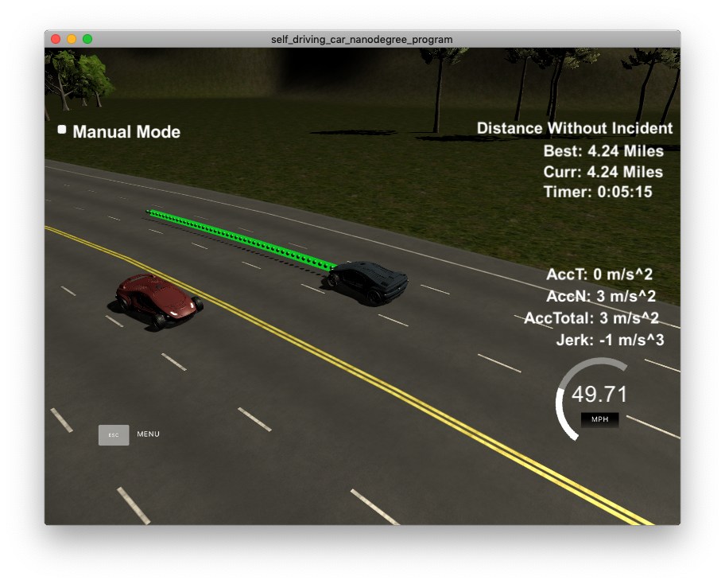
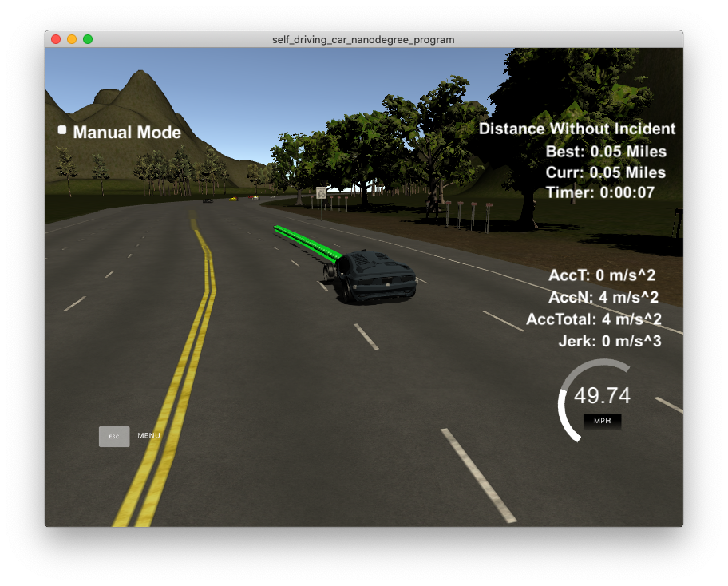
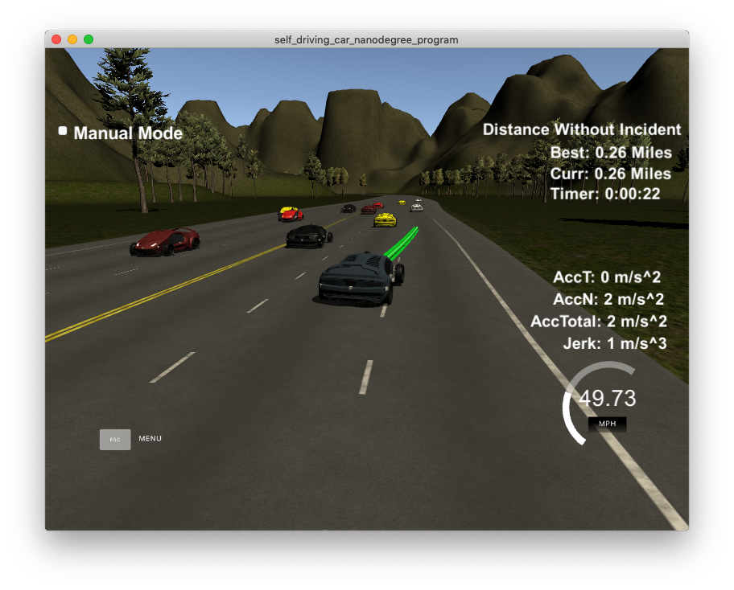
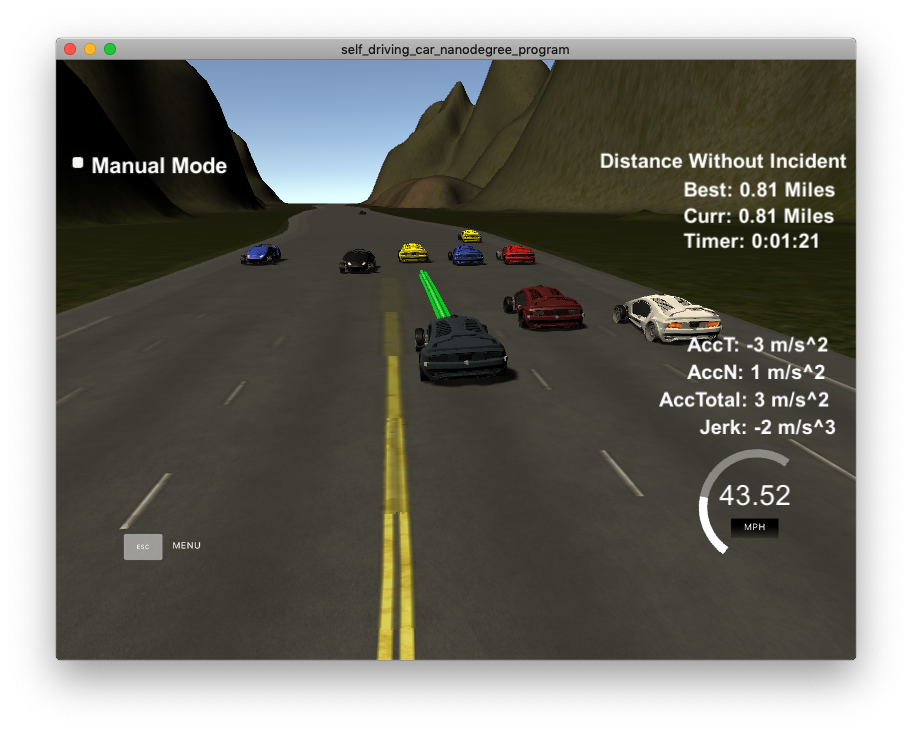
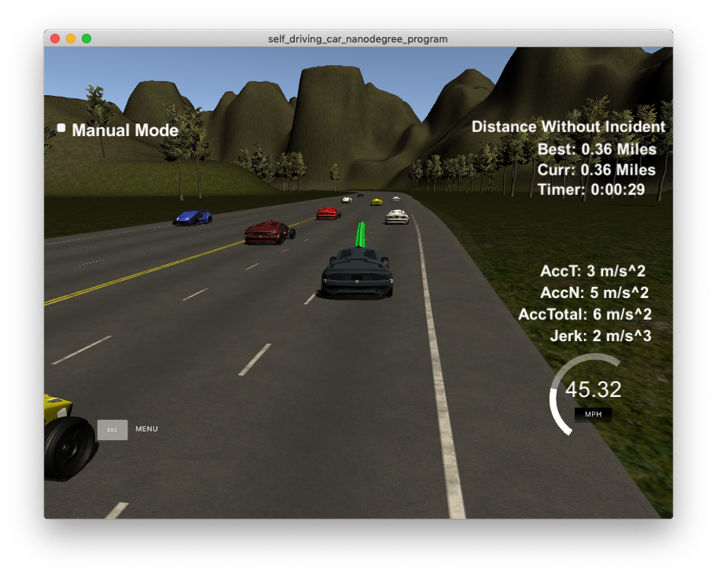
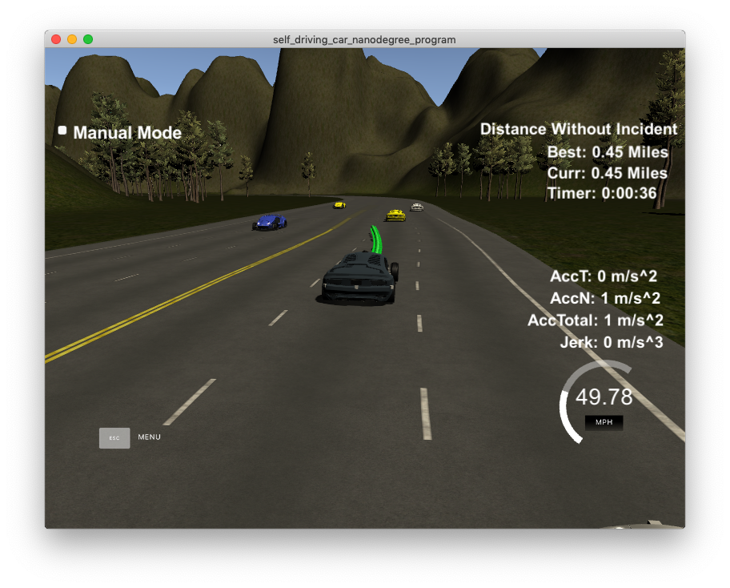

# CarND-Path-Planning-Project Writeup

The following is a writeup for the [Path Planning](https://github.com/udacity/CarND-Path-Planning-Project) project of the [Udacity Self-Driving Car Engineer Nanodegree Program](https://www.udacity.com/course/self-driving-car-engineer-nanodegree--nd013) based on the provided [Rubik](https://review.udacity.com/#!/rubrics/1971/view).

Refer to the projects original [README.md](https://github.com/udacity/CarND-Path-Planning-Project/blob/master/README.md) for details of how to set up this project, as well as how to install and run the required simulator.

# Rubik Points

## Compilation

### The code compiles correctly.

To compile the project:

1. Clone this repo.
2. Make a build directory: `mkdir build && cd build`
3. Compile: `cmake .. && make`
4. Run it: `./path_planning`.

## Valid Trajectories

### The car is able to drive at least 4.32 miles without incident.

The following screenshot shows the car reaching the 4.32 mile target without incident:



### The car drives according to the speed limit.

The max speed is defined as a constant:

```c++
19  const double MAX_SPEED = 49.9;
```

This constant is used as part of defining the behavior:

```c++
210 if (maintain_safe_distance)
211 {
212     ref_vel -= DECELERATION;
213 }
214 else
215 {
216     ref_vel += ACCELERATION;
217 }
218
219 if (ref_vel > MAX_SPEED)
220 {
221     ref_vel = MAX_SPEED;
222 }
```

The following screenshot shows the car reaching its max speed (displays slightly less than the configured 49.9 mph maximum speed due to the way the simulator averages the speed over distance):



### Max Acceleration and Jerk are not Exceeded.

Max acceleration and deceleration is managed by the following constants:

```c++
20  const double ACCELERATION = .224 * 2;
21  const double DECELERATION = .224 * 2;
```

These constants are used in the behavior step:

```c++
210 if (maintain_safe_distance)
211 {
212     ref_vel -= DECELERATION;
213 }
214 else
215 {
216     ref_vel += ACCELERATION;
217 }
```

Jerk is managed by using a [spline](https://en.wikipedia.org/wiki/Spline_(mathematics)) to plan the vehicles path.  

The first step in defining the spline is to identify the path's starting point.  If previous path data is available, the last 2 path points are used as the starting points for our spline.  If not, the cars current location, along with projecting a previous point by generating a path tangent to the known location and yaw, are used as the starting points:

```c++
239 if (prev_size < 2)
240 {
241     // if previous size is almost empty, use the car as starting reference
242    // use two points that make the path tangent to the car
243    double prev_car_x = car_x - cos(car_yaw);
244    double prev_car_y = car_y - sin(car_yaw);
245
246    ptsx.push_back(prev_car_x);
247    ptsx.push_back(car_x);
248
249    ptsy.push_back(prev_car_y);
250    ptsy.push_back(car_y);
251 }
252 else
253 {
254    // use the previous path's end point as starting reference
255
256    // redefine reference state as previous path end point
257    ref_x = previous_path_x[prev_size - 1];
258    ref_y = previous_path_y[prev_size - 1];
259
260    double ref_x_prev = previous_path_x[prev_size - 2];
261    double ref_y_prev = previous_path_y[prev_size - 2];
262    ref_yaw = atan2(ref_y - ref_y_prev, ref_x - ref_x_prev);
263
264    // use two points that make the path tangent to the previous path's end point
265    ptsx.push_back(ref_x_prev);
266    ptsx.push_back(ref_x);
267
268    ptsy.push_back(ref_y_prev);
269    ptsy.push_back(ref_y);
270 }
```
Three new trajectory points are then generated in Frenet coordinate space 30m apart, before being converted to Cartesian coordinate space.

```c++
272    // In Frenet add evenly 30m spaced points ahead of the starting reference
273    vector<double> next_wp_0 = getXY(car_s + 30, (2 + 4 * lane), map_waypoints_s, map_waypoints_x, map_waypoints_y);
274    vector<double> next_wp_1 = getXY(car_s + 60, (2 + 4 * lane), map_waypoints_s, map_waypoints_x, map_waypoints_y);
275    vector<double> next_wp_2 = getXY(car_s + 90, (2 + 4 * lane), map_waypoints_s, map_waypoints_x, map_waypoints_y);
276
277    ptsx.push_back(next_wp_0[0]);
278    ptsx.push_back(next_wp_1[0]);
279    ptsx.push_back(next_wp_2[0]);
280
281    ptsy.push_back(next_wp_0[1]);
282    ptsy.push_back(next_wp_1[1]);
283    ptsy.push_back(next_wp_2[1]);
```

The coordinates that we defined for our spline (`ptsx` and `ptsy`) are shifted and rotated so that the car's yaw is 0 degrees.  This is carried out so that we don't end up with functions that are near vertical and exploding (generating multiple values for `x` from the spline)

```c++
285    for (int i = 0; i < ptsx.size(); i++)
286        {
287        // shift car reference angle to 0 degrees
288        double shift_x = ptsx[i] - ref_x;
289        double shift_y = ptsy[i] - ref_y;
290
291        ptsx[i] = (shift_x * cos(0 - ref_yaw) - shift_y * sin(0 - ref_yaw));
292        ptsy[i] = (shift_x * sin(0 - ref_yaw) + shift_y * cos(0 - ref_yaw));
293    }
```

Using the path points, the spline is generated:

```c++
303    // create a spline
304    tk::spline s;
305
306    // set (x,y) poonts to the spline
307    s.set_points(ptsx, ptsy);
```

Path points are then retrieved from the spline (L333) and added to our planned path (L347-348):

```c++
320    // calculate how to break up spline points so that we travel at our desired velocity
321    double target_x = 30.0;
322    double target_y = s(target_x);
323    double target_dist = sqrt((target_x) * (target_x) + (target_y) * (target_y));
324
325    double x_add_on = 0;
326
327    // fill up the rest of our path planner after filling it with previous points, here we will always output 50 points
328    for (int i = 1; i <= 50 - previous_path_x.size(); i++)
329    {
330
331        double N = (target_dist / (.02 * ref_vel / 2.24)); // /2.24 converts from mph to m/s
332        double x_point = x_add_on + (target_x) / N;
333        double y_point = s(x_point);
334
335        x_add_on = x_point;
336
337        double x_ref = x_point;
338        double y_ref = y_point;
339
340        // rotate back to normal after rotating it earlier
341        x_point = (x_ref * cos(ref_yaw) - y_ref * sin(ref_yaw));
342        y_point = (x_ref * sin(ref_yaw) + y_ref * cos(ref_yaw));
343
344        x_point += ref_x;
345        y_point += ref_y;
346
347        next_x_vals.push_back(x_point);
348        next_y_vals.push_back(y_point);
349    }
```

### Car does not have collisions.

To avoid collisions, the prediction step predicts whether there may obstacles around us by first predicting the surrounding cars locations in the future (L138), then checking whether any cars will be predicted to be within our safe driving distance in our lane (L164-178), or whether any cars will be predicted to be within our safe driving distance or slightly behind us for both to our immediate left (L157-163) and right (L179-186) sides:

```c++
154 // obstacles based on other vehicles...
155 double other_distance = other_s - car_s;
156 double other_distance_projected = other_s_projected - car_s;
157 if (other_lane == (lane - 1))
158 {
159     // vehicle to our left, flag it as an obstacle if within a shorter safe driving distance, or just behind us
160     bool obstacle = ((other_distance_projected >= SAFE_DISTANCE_METRES_BEHIND) && (other_distance_projected < SAFE_DISTANCE_METRES_AHEAD));
161
162     obstacle_left |= obstacle;
163 }
164 else if (other_lane == lane)
165 {
166     // vehicle in our lane, flag it as an obstacle if within the safe driving distance,
167     bool obstacle = ((other_distance_projected >= 0) && (other_distance_projected < SAFE_DISTANCE_METRES_AHEAD));
168 
169     obstacle_ahead |= obstacle;
170     if (obstacle)
171     {
172         if (other_distance >= 0 && other_distance < obstacle_ahead_distance)
173         {
174             obstacle_ahead_distance = other_distance;
175             obstacle_ahead_speed = other_speed;
176         }
177     }
178 }
179 else if (other_lane == (lane + 1))
180 {
181    // vehicle to our right, flag it as an obstacle if within the safe driving distance, or just behind us
182    bool obstacle = ((other_distance_projected >= SAFE_DISTANCE_METRES_BEHIND) && (other_distance_projected < SAFE_DISTANCE_METRES_AHEAD));
183
184    obstacle_right |= obstacle; // | obstacle_rear;
185 }
```

The output of the prediction step, the potential obstacles, are used in the behviour step to change lanes if an obstacle is detected and it is safe to change lane.  If not safe to change lane, the car decelerates to maintain a safe driving distance:

```c++
188 // Based on the other predicted vehicles on the road, determine the behaviour to take
189 bool maintain_safe_distance = false;
190 string reason;
191 if (obstacle_ahead)
192 {
193     if (!obstacle_left)
194     {
195         reason = "obstacles ahead, nothing to left, overtaking";
196         lane--;
197     }
198     else if (!obstacle_right)
199     {
200         reason = "obstacles ahead, nothing to right, undertaking";
201         lane++;
202     }
203     else
204     {
205         reason = "obstacles ahead and left, maintaining safe distance";
206         maintain_safe_distance = true;
207     }
208 }
209
210 if (maintain_safe_distance)
211 {
212     ref_vel -= DECELERATION;
213 }
```

The following screenshot demonstrates the car changing lanes to avoid a collision:



The following screenshot demonstrates the car decelerating due to an obstacle ahead, but it is unable to change lanes to overtake:



The screenshot in the _The car is able to drive at least 4.32 miles without incident_ section is evidence of the car having no collisions.


### The car stays in its lane, except for the time between changing lanes.

Multiple screenshots above demonstrate the car staying in lane, until time to change lane due to an obstacle.

### The car is able to change lanes.

The flow described in the _Car does not have collisions_ section describes how the car is able to smoothly change (using a spline as part of path planning) lanes due to obstacles detected, and when it is safe to do so.

The following are additional screenshots of the car changing lanes:





## Reflection

### There is a reflection on how to generate paths.

The source code of `main.cpp` includes comments to document each of the path planning steps.  The previous sections above also describe how specific steps, such as collision detection and lane changing, are implemented as part of path planning.